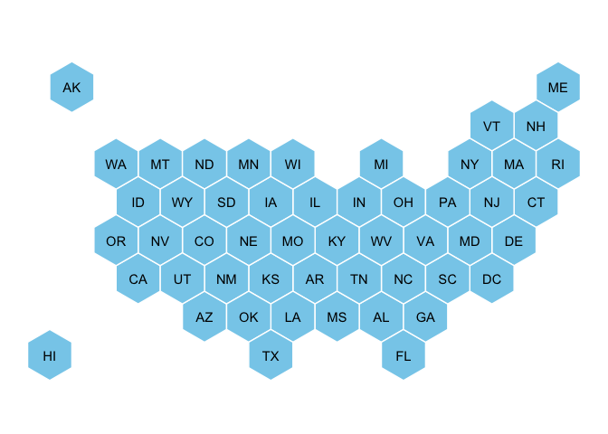
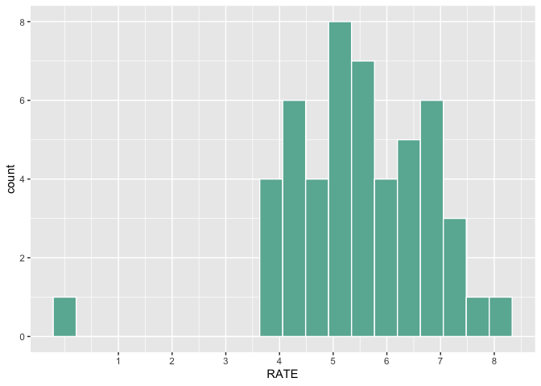
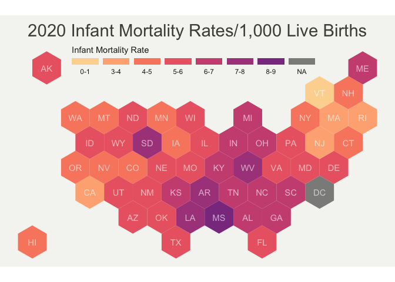

infant_mortality_cdc_visualization.Rmd
================
Regan, JD
2023-08-28

``` r
# read in hex grid using json
spdf <- geojson_read("us_states_hexgrid.geojson",  what = "sp")

# reformat the data
spdf@data = spdf@data %>%
  mutate(google_name = gsub(" \\(United States\\)", "", google_name))

# Show it
plot(spdf)
```

<!-- -->

``` r
#  fortify the data to be able to show it with ggplot2
spdf@data = spdf@data %>% mutate(google_name = gsub(" \\(United States\\)", "", google_name))
spdf_fortified <- tidy(spdf, region = "google_name")
```

    ## Warning: `tidy.SpatialPolygonsDataFrame()` was deprecated in broom 1.0.4.
    ## ℹ Please use functions from the sf package, namely `sf::st_as_sf()`, in favor
    ##   of sp tidiers.
    ## This warning is displayed once every 8 hours.
    ## Call `lifecycle::last_lifecycle_warnings()` to see where this warning was
    ## generated.

    ## Warning: The `region` argument of `tidy.SpatialPolygonsDataFrame()` is deprecated as of
    ## broom 1.0.4.
    ## ℹ Passing the `region` argument to this function will result in an error in a
    ##   later version of broom.
    ## Call `lifecycle::last_lifecycle_warnings()` to see where this warning was
    ## generated.

``` r
# find the center of each hexagon for labels
centers <- cbind.data.frame(data.frame(gCentroid(spdf, byid=TRUE), id=spdf@data$iso3166_2))
 
# plot I can plot this shape easily as described before:
ggplot() +
  geom_polygon(data = spdf_fortified, aes( x = long, y = lat, group = group), fill="skyblue", color="white") +
  geom_text(data=centers, aes(x=x, y=y, label=id)) +
  theme_void() +
  coord_map() 
```

<!-- -->

``` r
his_data <- read.table("https://raw.githubusercontent.com/holtzy/R-graph-gallery/master/DATA/State_mariage_rate.csv", header=T, sep=",", na.strings="---")
 
data <- read.table("cdc_data.csv", header=T, sep=",", na.strings="---")
data <- data %>% 
  filter(YEAR == 2020)

data <- data %>% 
  mutate_at("RATE", as.numeric)

data %>% 
  ggplot(aes(x=RATE)) + 
  geom_histogram(bins=20, fill='#69b3a2', color='white') +
  scale_x_continuous(breaks =seq(1,30))
```

<!-- -->

``` r
states <- his_data$state
states <- states[-9]
data <-
  data %>% 
  mutate(State = states)

spdf_fortified <- 
  spdf_fortified %>% 
  left_join(. , data, by=c('id'='State'))

ggplot() +
  geom_polygon(data = spdf_fortified, aes(fill =  RATE, x = long, y = lat, group = group)) +
  scale_fill_gradient(trans = "log") +
  theme_void() +
  coord_map()
```

    ## Warning: Transformation introduced infinite values in discrete y-axis

<!-- -->

``` r
# cuts the bins of rate categories
spdf_fortified$bin <- cut( spdf_fortified$RATE, breaks=c(seq(0,9), Inf), labels =c("0-1", "1-2", "2-3", "3-4","4-5", "5-6", "6-7", "7-8","8-9", "9-10"), include.lowest = TRUE)

# setting the color array with correct amount of colors
my_palette <- rev(magma(12))[c(-1,-12)]

# final plot
ggplot() +
  geom_polygon(data = spdf_fortified, aes(fill = bin, x = long, y = lat, group = group) , size=0, alpha=0.9) +
  geom_text(data=centers, aes(x=x, y=y, label=id), color="white", linewidth=3, alpha=0.6) +
  theme_void() +
  coord_map() +
  scale_fill_manual( 
    values=my_palette, 
    name="Infant Mortality Rate", 
    guide = guide_legend( keyheight = unit(3, units = "mm"), keywidth=unit(12, units = "mm"), label.position = "bottom", title.position = 'top', nrow=1) 
  ) +
  ggtitle( "2020 Infant Mortality Rates/1,000 Live Births" ) +
  theme(
    legend.position = c(0.49, 0.9),
    text = element_text(color = "#22211d"),
    plot.background = element_rect(fill = "#f5f5f2", color = NA), 
    panel.background = element_rect(fill = "#f5f5f2", color = NA), 
    legend.background = element_rect(fill = "#f5f5f2", color = NA),
    plot.title = element_text(size= 22, hjust=0.5, color = "#4e4d47", margin = margin(b = -0.1, t = 0.4, l = 2, unit = "cm")),
  )
```

    ## Warning: Using `size` aesthetic for lines was deprecated in ggplot2 3.4.0.
    ## ℹ Please use `linewidth` instead.
    ## This warning is displayed once every 8 hours.
    ## Call `lifecycle::last_lifecycle_warnings()` to see where this warning was
    ## generated.

    ## Warning in geom_text(data = centers, aes(x = x, y = y, label = id), color =
    ## "white", : Ignoring unknown parameters: `linewidth`

<!-- -->
